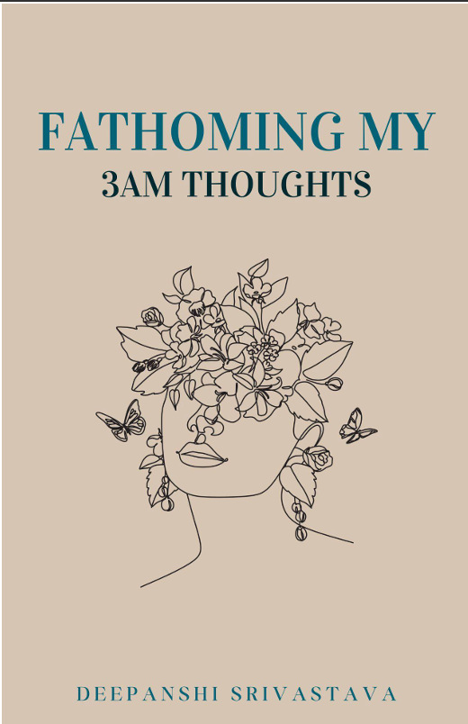

CSS
.book-mock{
    margin-top:40px;
    width:210px;
    height:292px;
    background:
      linear-gradient(90deg, rgba(255,255,255,.07) 1px, transparent 1px),
      linear-gradient(135deg, #6f0820 0%, #ac4b76 55%, #d798b5 100%);
    background-size:20px 20px, 20px 20px, auto;
    color:#fff;
    padding-top:20px;
    display:flex;
    flex-direction:column;
    justify-content:flex-end;
    box-shadow:10px 10px 0 rgba(120,9,34,.16);
  }
  .book-mock .tiny{
    font-size:10px;
    letter-spacing:.16em;
    text-transform:uppercase;
    color:rgba(255,255,255,.68);
    margin-bottom:auto;
  }
  .book-mock h4{
    font-family:'Playfair Display',serif;
    font-size:34px;
    line-height:1.02;
    font-style:italic;
  }

  .social-follow{
    margin-top:18px;
    border:1.2px solid var(--line);
    background:linear-gradient(135deg, #fffdfa 0%, #fdeff3 100%);
    padding:24px 24px 22px;
    min-height:170px;
    display:grid;
    grid-template-columns:1.2fr .8fr;
    gap:16px;
    align-items:center;
  }
  .social-follow h3{
    font-family:'Playfair Display',serif;
    font-size:34px;
    line-height:1;
    margin-bottom:10px;
  }
  .social-follow h3 em{
    color:var(--rose);
    font-family:'Cormorant Garamond',serif;
    font-style:italic;
    font-weight:600;
  }
  .social-follow p{
    color:var(--muted);
    font-size:14px;
    line-height:1.9;
    max-width:560px;
  }
  .social-follow .right{
    display:flex;
    flex-direction:column;
    gap:10px;
    align-items:flex-start;
    justify-content:center;
  }
  .handle{
    font-size:12px;
    letter-spacing:.12em;
    text-transform:uppercase;
    color:var(--muted-2);
    font-weight:700;
  }

  .footer-cta{
    border-top:1.2px solid var(--line);
    background:
      linear-gradient(rgba(255,255,255,.08) 1px, transparent 1px),
      linear-gradient(90deg, rgba(255,255,255,.08) 1px, transparent 1px),
      linear-gradient(135deg, #790922 0%, #95234b 45%, #d88dad 100%);
    background-size:28px 28px, 28px 28px, auto;
    color:#fff;
    padding:46px 36px;
    display:grid;
    grid-template-columns:1fr .85fr;
    gap:28px;
    align-items:center;
  }

HTML
<section class="bottom-feature">
      

        
Before L&amp;M, there was—

        <h2>Before L&amp;M became a world, it was a <em>voice after midnight.</em></h2>
        

          <!--
Poetry book

          <h4>Fathoming My 3AM Thoughts</h4>-->
          
        

        

          <em>Fathoming My 3AM Thoughts</em>xxxxxxxxx
        

        

          xxxxxxxxx
        

        

          xxxxxxxxx
        

        

          <a class="btn primary" href="https://amzn.in/d/05zogC9d" target="_blank" rel="noopener noreferrer">Find the book on Amazon</a>
        

        

          

            
Beyond the website

            <h3>For the in-between moments, <em>follow along.</em></h3>
            

              xxxxxxxxxx.
            

          

          

            
Instagram / @yourhandle

            <a class="btn soft" href="https://instagram.com/" target="_blank" rel="noopener noreferrer">Follow on Instagram</a>
          

        

        
      

